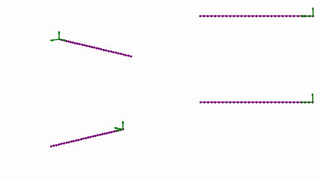

# RodiCS

<p align="center">
    
    
</p>
<p align="center">
  Elastic rods in action. On the left, a rod sways under an oscillatory flow. Right, a surface wave passes through the rod.
</p>

RodiCS is a Python code that simulates static and dynamic deformation of elastic rods. It solves the Kirchhoff equations with finite elements using the [FEniCS](https://fenicsproject.org/) platform.

This code was written during my Masters research project at Polytechnique Montréal:

[Mouad Boudina (2020). On the Mechanics of Flow-Induced Vibration of Soft Corals and Particle Interception. Polytechnique Montréal.](https://publications.polymtl.ca/5378/)

Rod simulations are the subject of Chapter 7. You'll find the Kirchhoff equations, the mechanical and fluid-dynamical load expressions, verification and validation of the code, and finally simulation cases. I also included in it an appendix on the FEniCS implementation in Python, describing the syntax and functions used in the code.

Please do check the document `RodiCS_a_finite_element_solver_of_Kirchhoff_rods_under_fluid_flow_and_more.pdf`, it summarises the global perspective of the code and lists some of its advantages.

## Dependencies

RodiCS works on Python (version 3.8.2), and requires FEniCS (version 2019.1.0), as well as NumPy (version 1.17.4) and Matplotlib (version 3.1.2) modules. Only for data postprocessing or code validation, you'll also need SciPy (version 1.4.1).

## Usage

### Mesh

First you will need a mesh file of the rod. The mesh consists of one-dimensional intervals embedded in a three-dimensional space. It can be saved into an `.xml` file. There are already some mesh files in the folder `xmf_files/`. Though, you can generate your own mesh with the script `create_xml.py`.

As a quick check whether the mesh is well loaded and represents the shape desired, there is the script `read_mesh.py` which reads the mesh and plots it in 3D.

### Solver

The main file for each simulation type is called:
- `static.py` for static deformations,
- `dynamic.py` for transient simulations,
- `wake_oscillator.py` for the wake-oscillator model.

Accordingly, the solving functions are `run_static`, `run_dynamic`, and `run_wake_oscillator`.

#### Static case
The function `run_static` requires:

- `mesh`: a Mesh object from the FEniCS library,
- `u0`: direction of the load/flow,
- `which_force`: available load case (for now there are the two options `distributed` for a uniform load and `drag` for the fluid-dynamic drag),
- `force_mag`: dimensionless magnitude of the force.

#### Dynamic case
The function `run_dynamic` requires the same argument as in the static case, in addition to:

- `dt`: time step size,
- `Nt`: number of time steps,
- `Ur`: reduced velocity,
- `Gamma`: aspect ratio of the rod,
- `speed_function`: time function of the flow speed magnitude. It takes only the time as an argument. For other parameters, they are accounted as global variables, i.e. defined in the execution script before the function definition.

#### Wake-oscillator model
The function `run_wake_oscillator` in `wake_oscillator.py` is written in the same fashion as `run_dyamic`. Because the wake-oscillator model assumes that the vortex-induced lift is an additional unknown governed by the van der Pol equation (see [Facchinetti et al. (2004)](https://www.sciencedirect.com/science/article/abs/pii/S0889974603001853)), we consider a new mixed space solution with additional subspaces, and the van der Pol equation is included in the final variational form.

### Examples
In each example, you can open the file and tune the parameters as you wish. You can either launch the following command in terminal
```
python3 example_name.py
```
or execute it in a Python interactive editor such as [Spyder](https://www.spyder-ide.org/).

#### Static case
The file `example_static_distributed.py` gives the deformation of a rod under a uniformly distributed load. After the simulation has done, a window will open with a 3D view of the rod.

Another example is in `example_static_drag.py`, which simulates a rod under static drag for different flow speeds. A figure will appear showing the deformations with a top view.

#### Transient case
We suggest three examples. The files `example_dynamic_ramp_up.py` and `example_dynamic_oscillatory.py` simulate the motion of a rod under a ramp up flow speed and an oscillatory flow. The file `example_wake_oscillator_ramp_up.py` simulates the motion of a rod under a ramp up flow speed, arising vortex-induced vibrations.

In each of theses examples, a graphical window will open after the simulation has done. It means that an image sequence of the simulation is being saved. The sequence will be saved in the folder `output/`. If you want to make an animation of it, you can use some software like [ffmpeg](https://ffmpeg.org/ffmpeg.html) or [imageJ](https://imagej.net/Welcome). Moreover, there is the possibility to view the solution at a precise instant. Function plotting the time evolution of the tip displacement, as well as the deformation profiles in time, are also available, imported from the file `postprocessing.py`. If you want to test these features, you need to uncomment them.

It should be borne in mind that transient simulations might take time before completing, especially if the chosen time step is small, or the final instant is large.

### Verification and validation
For the static case, the script `verification_static.py` simulates the deformation of rods, under a uniformly distributed load, for meshes of different refinement levels. The discretisation error and the observed order of convergence are then calculated and plotted. There is also the script `validation_static.py` which runs simulations of rods under different uniformly distributed loads, then compares the tip deflection with the theoretical fomula proposed by [Rohde (1952)](https://www.ams.org/journals/qam/1953-11-03/S0033-569X-1953-56438-6/S0033-569X-1953-56438-6.pdf).

For the dynamic case, the script `verification_dynamic.py` also simulates the deformation of rods under a uniformly distributed load in time, with this time fixing the mesh and refining the time step. Here again, the discretisation error and the observed order of convergence are calculated and plotted.

### Visualisation
The visualisation and graphical tools are written in the file `visualisation.py`.

## Contributing
Reports of any kind of issues and bugs that might be encountered in the code are very welcome.

Please feel free to pull requests to improve this module. Examples of ideas or improvements we look forward to are:
- solver optimisation,
- high order time integration schemes,
- branched and arborescent structures,
- space-variating parameters, such as a non-uniform flow speed, heterogeneous rod material...
- additional forces, like gravity/buoyancy and electric/magnetic forces...
- simulation and code tests,
- advanced visualisation tools...

## Citing
[](https://doi.org/10.5281/zenodo.4023287)

This code is made for sharing. If you find it helpful in your work, here is the DOI number to cite it: 10.5281/zenodo.4023287. A possible BibTeX entry might be:
```
@misc{rodics2020,
  title = {{RodiCS}: a finite element solver of {Kirchhoff} rods under fluid flow and more},
      doi = {10.5281/zenodo.4023287},
      url = {https://github.com/lm2-poly/RodiCS},
      publisher = {Zenodo},
      author = {Boudina, M.},
      year = {2020}
}
```

Hope you'll enjoy deforming rods!

## License
[MIT](https://choosealicense.com/licenses/mit/)

